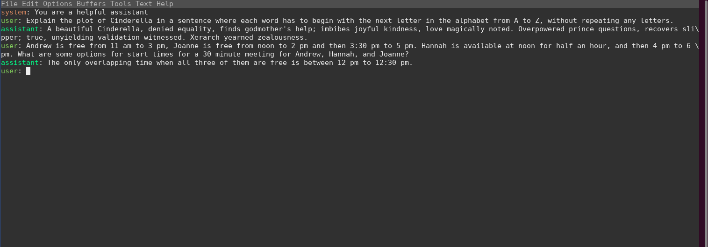

# OpenAI Chat Emacs

OpenAI Chat Emacs is an Emacs major mode for interacting with OpenAI's chat API. It enables users to interactively chat with the AI model directly from their Emacs editor. The Emacs package offers a user-friendly interface with clearly marked roles (system, user, assistant) and corresponding chat messages.



## Installation

1. Clone this repository to your local machine.
2. Add the path of the cloned repository to your Emacs `load-path`.
3. Require the 'openai-chat' in your Emacs configuration (`init.el` or `.emacs` file):

```elisp
(add-to-list 'load-path "/path/to/your/clone/directory")
(require 'openai-chat)
Usage
Start a new chat session with OpenAI's chat API by calling M-x openai-chat-start. This opens a new buffer with the chat interface.
Enter your message after the 'user: ' prompt and press C-c RET to send your message to the API. The assistant's reply will appear below your message.
To change the model, use C-c C-n and enter the model name.
Remember to replace /path/to/your/clone/directory with the actual path where you've cloned this repository.

Features
Color coded roles (system, user, assistant) for easier chat readability.
Model changing functionality.
Buffer change hook to color new lines.

Prerequisites
Before using OpenAI Chat Emacs, you'll need to:

Install the request, json, and org-id Emacs packages.
Create an OpenAI account and obtain an API key. Then, save the API key in a file located at ~/.openai/apikey.
(Optional) Specify the model in a file located at ~/.openai/model. If you don't specify a model, it will use gpt-3.5-turbo by default.

Debugging
To enable debugging, set the OPENAI_CHAT_EMACS_DEBUG environment variable. This prints debug messages to the Emacs Messages buffer (C-x C-e).

Disclaimer
This project is not officially associated with OpenAI. Please follow OpenAI's use case policy while using this mode.

Contributing
Contributions are welcome! Please feel free to submit a pull request or create an issue.

License
This project is licensed under the MIT License.